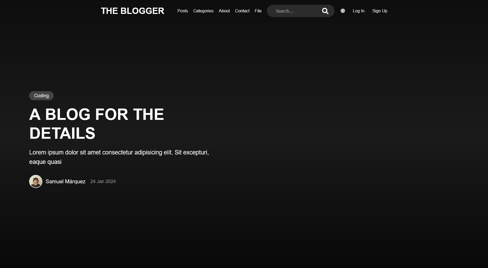

# Blog Template - Frontend Showcase

---

## 🔹 Overview

This project is a **blog template** designed to **showcase frontend skills**.  
It is primarily meant as a **portfolio piece** rather than a fully functional blog.  

- Modern and responsive design  
- Clean and organized interface  
- Template ready for dynamic content  
- Simulated database using a JavaScript file (`posts.js`)  
- **Search functionality is not yet implemented**  
- **Add a post functionality is not yet implemented**

---

## 🔹 Project Preview

Here’s a quick look at the blog template:



---

## 🔹 How to Use

1. Clone the repository:

```bash
git clone https://github.com/samuelmarquez833/blog.git
